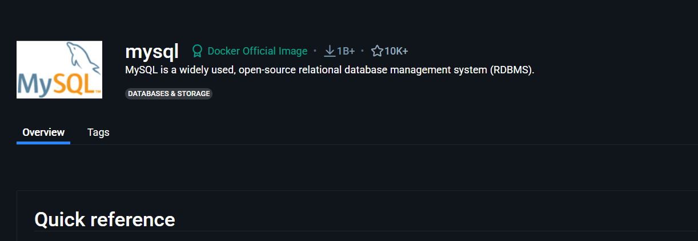
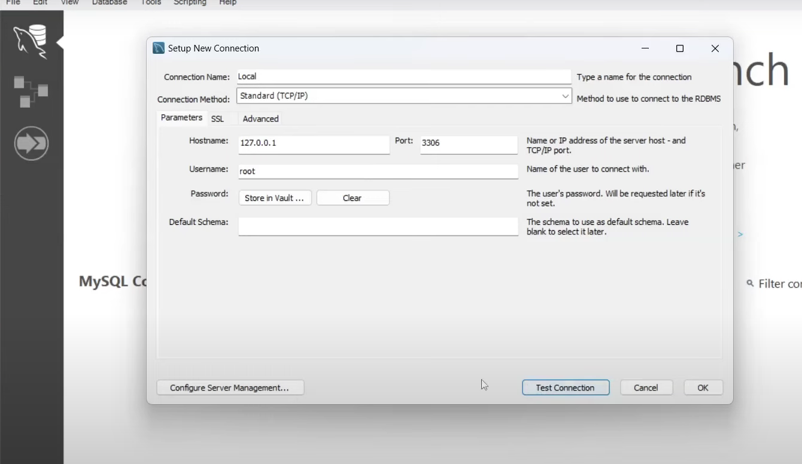
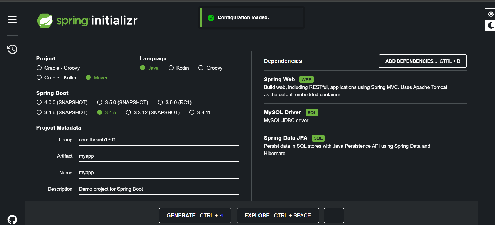
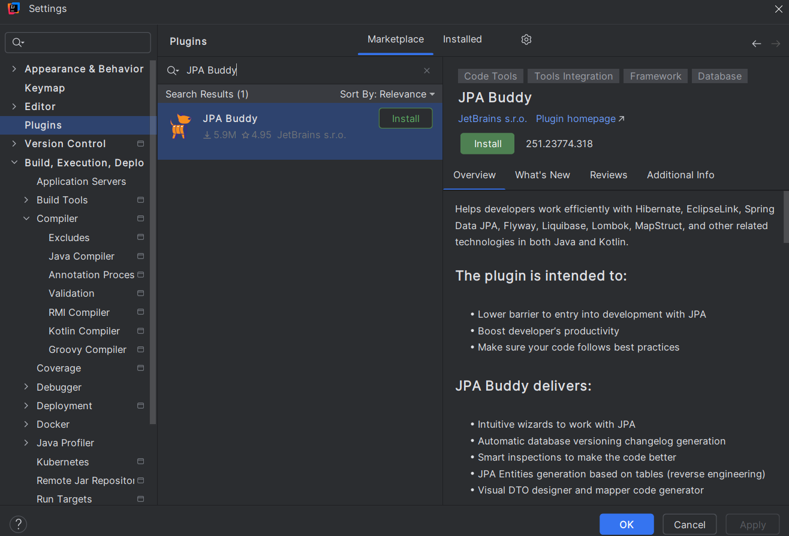
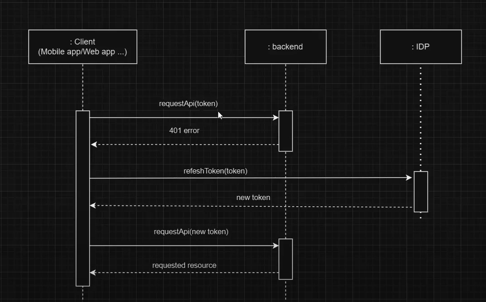
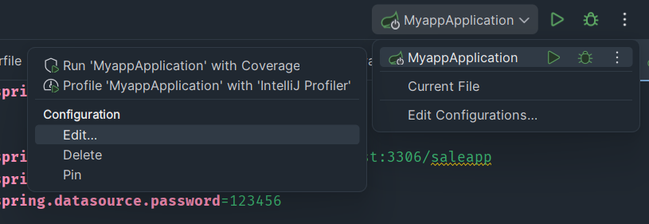
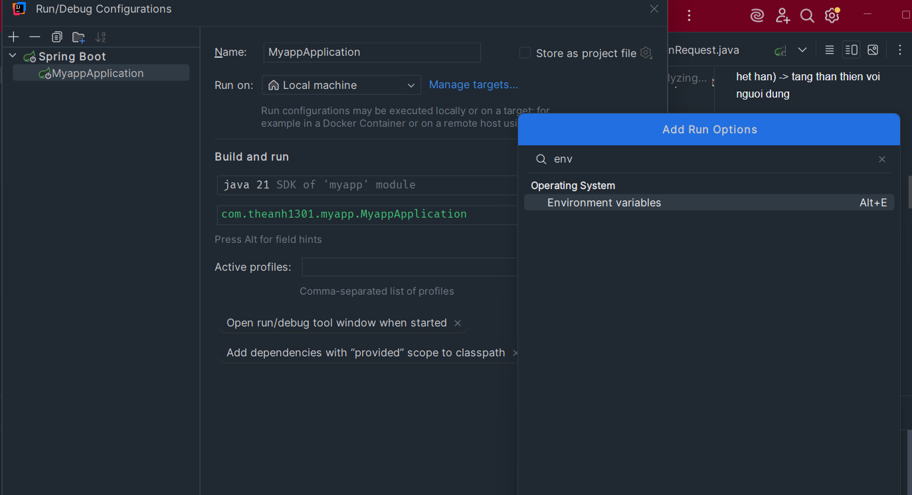
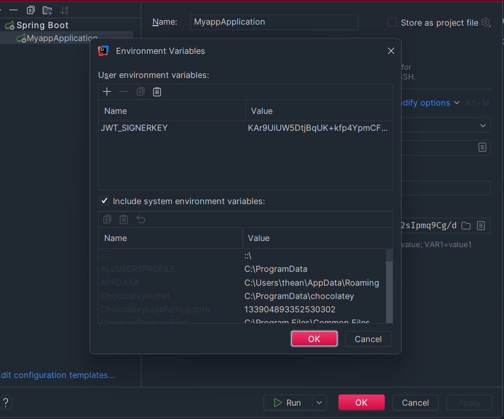
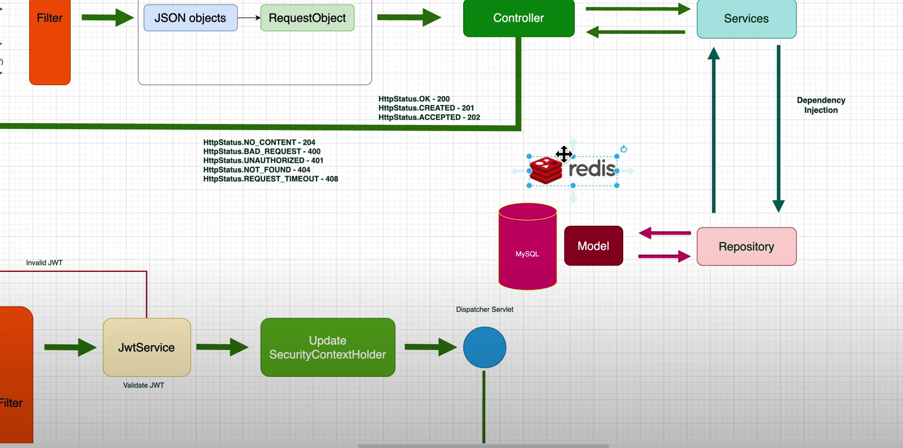

###
<h2>Connection mysql docker</h2>
đã đc pull về docker hub
```
-CMD :
docker pull mysql:latest
```
Truy cập overview


Starting a MySQL instance is simple:  -> run image  để tạo container   (mysql:latest tên và tag của image)  , tên của container(--name spring-mysql)
```
Cmd :
$ docker run --name spring-mysql -p 3309:3306 -e MYSQL_ROOT_PASSWORD=123456 -d mysql:latest   (latest là tên tag)
```

Connection tới mysql workbench


spring.jpa.hibernate.ddl-auto=update -> Tạo database từ pojo




###
Nhớ lấy mapstruct lấy riêng trên maven 

mapstruct - processor -> thêm ở cofi chứ không phải dependencies


<!-- https://mvnrepository.com/artifact/org.mapstruct/mapstruct-processor -->
<dependency>
    <groupId>org.mapstruct</groupId>
    <artifactId>mapstruct-processor</artifactId>
    <version>1.6.3</version>
</dependency>

//Mapstruct core -> mapper dto.request vào pojo(entity) thay vì map thủ công 

<!-- https://mvnrepository.com/artifact/org.mapstruct/mapstruct -->
<dependency>
    <groupId>org.mapstruct</groupId>
    <artifactId>mapstruct</artifactId>
    <version>1.6.3</version>
</dependency>

lombok-mapstruct-binding  -> thêm ở cofi chứ không phải dependencies

<!-- https://mvnrepository.com/artifact/org.projectlombok/lombok-mapstruct-binding -->
<dependency>
    <groupId>org.projectlombok</groupId>
    <artifactId>lombok-mapstruct-binding</artifactId>
    <version>0.2.0</version>
</dependency>

//Bật pluglin lombok trong IDE 
//Bật enable (Annotation processors)


### 
Không dùng Autowired dùng 
@RequiredArgsConstructor // constructor final
@FieldDefaults(level = AccessLevel.PRIVATE , makeFinal = true) // private final


<h2>Grenated sql code </h2> 

JPA Buddy 



#Refesh token -> de luu trang thai dang nhap (vi token co the het han) -> tang than thien voi nguoi dung




<h1>Setup env</h1>






```
spring.datasource.password=${DBMS_PASSWORD:root}
📌 Nghĩa là:

Nếu biến môi trường DBMS_PASSWORD tồn tại, nó sẽ lấy giá trị từ biến môi trường đó.


Nếu biến DBMS_PASSWORD không có, thì nó sẽ dùng giá trị mặc định là "root"
```
NOTE ENV
```
Phải tuân theo nguyên tắc chuyển tất cả thành chữ hoa và thay dấu chấu bằng dấu _
Cứ xóa đi khỏi application.properties vì nó sẽ tự đọc trong env
```

Hoặc có thể  đặt tên không cần giống và vẫn giữ lại trong application.properties thì cần ${DATA_URL} 



#Build thu cong (build bang java) 
```
java --version

-truoc do phai ./mvnw clean -> de  xoa target

./mvnw package -DskipTests -> tao ra file .jar  0.0.1.SNAPSHOT la phien ban

```
- mo cmd chua file jar :  java -jar .\ten file jar -> spring boot da chay Ctrl C de tat
- co the dem file jar qua may khac chay binh thuong

#Build bang maven (cai apache maven)

```
- mvn --version
- mvn clean
- mvn package -DskipTests
```


#Build voi docker


Docker desktop 


-> build Image -> thành container

docker ps -> các docker đang chạy
-Vào 1 container
-vao exec 
```
pwd -> ktra thư mục đang đứng
cd / -> về thư mục gốc
ls -la -> ktra các thư mực 
cat /etc/os-release  -> in toàn bộ thông tin của container

```
-lúc build docker mình đã xóa application-prod.properties vì chứa utf-8 

#Tiến hành build docker ở thư mục hiện tại (Open docker desktop) - luôn phải clean target trc

```
docker build -t myapp:0.0.1 .  (myapp = name app)
docker run -d myapp:0.0.1
```


#Redis danh cho cac truy van nhieu (redis luu tam truy van)
-> Nhung nho la khi update cung phai update redis




<h2>Build docker hub </h2>
--Phải chạy docker desktop trước

- Build docker image (xem lại trong desktop có chưa)
```
docker build -t theanh1301/myapp-service:0.9.0 .   (thay account bằng tên docker hub chạy trong terminal)
docker image ls
```
Push docker image to Docker Hub (Xem lại trên dockerhub có chưa)
```
docker image push theanh1301/myapp-service:0.9.0
```


Có thể thử xóa image trên desktop và pull nó về


```
docker image rm <tên image>  (xem bằng docker image ls)
docker pull theanh1301/myapp-service:0.9.0  
```

<h2>Create network</h2>
```
docker network create devtheanh-network
```
<h2>Start MySQL</h2> ( -- jdbc:mysql://localhost:3309/saleapp)
```
Ktra các network
docker network inspect devtheanh-network


Có thể thêm vào network
docker network connect devtheanh-network spring-mysql


 docker run --network devtheanh-network --name spring-mysql -p 3309:3306 -e MYSQL_ROOT_PASSWORD=123456 -d mysql:latest
```
<h2>Run your application </h2>
```
theanh1301/myapp-service:0.9.0 - tên của container trên desktop

 
```
docker run --name myapp-service --network devtheanh-network -p 8080:8080 -e DATASOURCE_URL=jdbc:mysql://spring-mysql:3306/saleapp -e DB_USERNAME=root -e DB_PASSWORD=123456 -e JWT_SIGNERKEY=KAr9UiUW5DtjBqUK+kfp4YpmCFdQGsp7U/OXR0N90/7HvaJOlFNou2sIpmq9Cg/d theanh1301/myapp-service:0.9.0 
```


